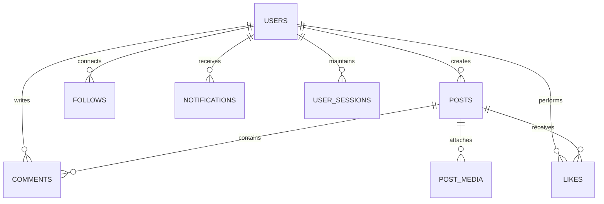

# V-Social: Documentación Exhaustiva y Registro Arquitectónico (Beta v0.6.0-beta.1)

> [!NOTE]
> Este documento técnico refleja el **espectro completo** del desarrollo, decisiones de arquitectura, módulos implementados, ideologías de diseño, optimizaciones algorítmicas y configuraciones de infraestructura de la plataforma **V-Social**. Es el plano maestro de la aplicación actualizado con todas las implementaciones, rediseños y optimizaciones.

---

## 1. Pila Tecnológica (Tech Stack Completo)

### 1.1 Core Frontend
- **Framework Base:** SvelteKit 5 (Renderizado Híbrido: SSR para primer paint y SEO + CSR para interactividad ultra-fluida).
- **Gestión de Estado:** Runes de Svelte 5 (`$state`, `$derived`, `$props`) en modo estricto, sustituyendo stores legados por reactividad granular y quirúrgica sin sobrecarga de runtime. Stores globales rune-based en `lib/stores/*.svelte.js`.
- **Estilos & UI:** Sistema propio **Glassmorphism 2.0 / Neo-Aero** implementado en **CSS puro tokenizado** (`routes/layout.css`), eliminando dependencias pesadas de runtime como Tailwind o DaisyUI.
- **Iconografía & Tipografía:** Google Fonts (`Inter` para textos, `Outfit` para títulos de impacto, `Fira Code` para bloques de código, `Material Icons Round` y `Noto Color Emoji` nativo).
- **Empaquetador & Pipeline:** Vite 8 con `@sveltejs/adapter-node` para producción standalone, compresión pre-renderizada (brotli/gzip) y soporte PWA cache-first.

### 1.2 Core Backend (Node.js Integrado)
- **Capa API Monolítica Disciplinada:** Rutas SvelteKit Server-Side con despachador catch-all (`src/routes/api/[modulo]/[...path]/+server.js`) con manejo uniforme de métodos HTTP (`GET`, `POST`, `PUT`, `DELETE`, `PATCH`).
- **Autenticación & Sesiones:** JSON Web Tokens (JWT) mediante `jsonwebtoken` con expiración default de 365 días. Token almacenado en `localStorage` (`vsocial_token`) y sincronizado con cookie client-side `Secure; SameSite=Strict`. Hash **SHA-256** del token en tabla `user_sessions` junto a IP y User-Agent. Funciones guardianas `requireAuth()`, `optionalAuth()`, `requireAdmin()` en `lib/server/auth.js`.
- **Hashing de Credenciales:** `bcryptjs` con coste de hashing balanceado (cost 10).
- **Validación & Sanitización:** Validadores basados en expresiones regulares y sanitización propia (`lib/server/security.js` y `lib/server/entities.js`). Sanitización contra XSS en tags HTML, hashtags y menciones.
- **Control de Tráfico:** Rate limiter in-memory en `hooks.server.js`: **1000 req/min por IP** y **2000 req/min por usuario autenticado** (claves `ip:`/`usr:`), con bypass para staff y localhost, y exclusión de `/api/gamification/heartbeat` y `/api/health`.
- **Comunicaciones en Tiempo Real:** `socket.io` (chat DM + grupos, typing indicators, presencia en memoria `Map<userId, Set<socketId>>`, push instantáneo de notificaciones `new_notification`) + `lib/rtc.js` para señalización WebRTC (`/api/rtc/signal`).

### 1.3 Infraestructura de Datos & Persistencia
- **Motor de Base de Datos:** SQLite 3 transaccional en modo **WAL (Write-Ahead Logging)** (`journal_mode=WAL`, `synchronous=NORMAL`, `foreign_keys=ON`, `busy_timeout=5000`, `cache_size=-64000`, `temp_store=MEMORY`).
- **Driver de Conexión Universal:** `@libsql/client` como driver primario (con soporte para WAL local y réplicas remotas en Turso).
- **Adaptador DB Async Unificado (`lib/server/db.js`):** Toda la API de base de datos es 100% asíncrona (`db.prepare(sql).run() / .get() / .all()`), asegurando compatibilidad total con llamadas `await` sin bloqueos de event-loop.
- **Filosofía Raw SQL:** Cero ORMs. Todas las consultas son SQL explícito parametrizado con placeholders seguros `?` y sentencias preparadas reutilizables para máximo rendimiento de I/O y latencia sub-milisegundo.

---

## 2. Esquema Relacional de Base de Datos (14 Dominios)

El esquema canónico único reside en `schema_sqlite.sql` (949 líneas SQL idempotentes con `CREATE TABLE IF NOT EXISTS`). La estructura cubre 14 dominios funcionales:



### Dominios Principales:
1. **Users & Auth:** `users` (con campos RGPD `birth_date`, `deleted_at`, `terms_accepted_at`, `privacy_accepted_at`), `user_roles`, `user_titles`, `user_sessions`, `user_settings`.
2. **Posts & Content:** `posts` (soporte para `mood`, encuesta serializada en `body`, `location_name`, `scheduled_at`), `post_media`, `post_likes`, `post_reactions`, `comments`, `comment_reactions`, `saved_posts`, `hashtags`, `post_hashtags`, `check_ins`.
3. **Stories & Highlights:** `stories` (24h efímeras), `story_highlights`, `story_highlight_items`.
4. **Reels:** `reels`, `reel_likes`, `reel_comments`.
5. **Mensajería:** `conversations`, `conversation_participants`, `messages_new`, `message_reactions`, `message_read_receipts`.
6. **Notificaciones & Moderación:** `notifications`, `reports` (pendientes, en revisión, resueltos, descartados).
7. **Marketplace:** `marketplace_categories`, `marketplace_listings`, `listing_media`.
8. **Freelance Gigs:** `gigs`, `gig_applications`.
9. **Push Notifications:** `web_push_subscriptions` (VAPID).
10. **Sistema & Configuración:** `system_settings`, `sponsored_posts`, `cms_pages`.
11. **Grupos & Páginas:** `groups`, `group_members`, `group_posts`, `group_events`, `pages`, `page_followers`.
12. **Seguridad:** `oauth_accounts`, `email_tokens`, `blocked_users`, `snoozed_users`.
13. **Personalización Estética:** `profile_customizations` (fondos, fuentes, blur, opacidad, CSS custom).
14. **Infraestructura & Gamificación:** `system_cache`, `rtc_signals`, `daily_xp_limits`, `activity_logs`.

---

## 3. Algoritmos Transparentes de Feed (Mecanismos Anti-Caja Negra)

VSocial rechaza los algoritmos opacos de retención tóxica diseñados para maximizar la adicción. En su lugar, implementa un motor de descubrimiento transparente y configurable por el usuario con tres modos bien definidos:

### 3.1 Radar en Vivo (Línea de Tiempo Estricta)
- **Mecánica:** Ordenamiento cronológico 100% estricto (`ORDER BY created_at DESC`).
- **Propósito:** Mostrar exactamente lo que está sucediendo en la plataforma en tiempo real a nivel global.
- **Filtro Idiomático:** Segmentación transparente por el idioma principal configurado del usuario para prevenir ruido lingüístico irrelevante sin ocultar contenido ni alterar el orden temporal.

### 3.2 Feed Inteligente (Afinidad y Ponderación Abierta)
- **Mecánica:** Ordenamiento por puntuación matemática basada en señales directas del grafo social:
  $$\text{Score} = (W_{\text{author}} \cdot S_{\text{follow}}) + (W_{\text{tags}} \cdot S_{\text{tag\_affinity}}) + (W_{\text{cat}} \cdot S_{\text{category}}) + \text{Decay}(t)$$
- **Factores Clave:**
  - Afinidad explícita por creadores con los que el usuario interactúa frecuentemente.
  - Ponderación por hashtags seguidos e interactuados.
  - Sub-caps de popularidad: evita que un solo post viral monopolice el feed de todos los usuarios.
  - Cero supresión oculta de publicaciones por motivos comerciales o sombras algorítmicas (anti-shadowban).

### 3.3 Descubrimiento (Para Ti Equitativo)
- **Mecánica:** Motor de descubrimiento enfocado en frescura y relevancia orgánica.
- **Distribución Justa:** Brinda visibilidad a nuevos creadores y contenido emergente con alto engagement relativo, rompiendo los monopolios de cuentas masivas.
- **Decay Temporal Logarítmico:** Garantiza rotación continua del contenido destacado sin atrapar al usuario en bucles infinitos de contenido antiguo.

### 3.4 In-Memory Batch Writer & Mitigación Heurística de Bots
- **In-Memory Batch Writer:** Agrupador de escrituras de métricas de alta frecuencia (visualizaciones, contadores de reproducciones) en búferes de memoria antes de persistir a SQLite, eliminando contención de escritura en el WAL.
- **Motor de Reputación de Autores:** Detección heurística de patrones de bots/spam (frecuencia anómala de publicaciones, ráfagas de enlaces repetidos) y asignación dinámica de factores de confianza.

---

## 4. Innovaciones de Creación e Interactividad

### 4.1 Moods (Estados de Ánimo) con Física Táctil
- Selector en `/posts/create` con 10 moods canónicos (Feliz 😄, Creativo 🎨, Jugando 🎮, Música 🎵, Pensando 🤔, Emocionado 🔥, Viajando ✈️, Celebrando 🥳, Trabajando 💻, Comiendo 🍔).
- Persistencia en columna `posts.mood` (`VARCHAR(30)`).
- **Scroller con Física Real:** Implementación de *drag-to-scroll* táctil con inercia, desaceleración por `requestAnimationFrame`, *overscroll* elástico y desvanecimiento de bordes (*edge fading*), eliminando flechas toscas.

### 4.2 Encuestas Nativas (Polls)
- Creación de encuestas con 2 a 6 opciones y duración configurable (1h, 6h, 24h, 3d, 7d).
- **Serialización Estructurada:** Almacenadas en bloque `\n[METADATA]` JSON al final del `body` del post:
  ```json
  { "poll": { "question": "...", "options": [{"text": "A", "votes": 0}], "voted_user_ids": [] } }
  ```
- **Votación Atómica:** Endpoint `POST /api/posts/:id/vote` con validación de un solo voto por usuario y actualización reactiva en `PostCard.svelte`.

### 4.3 Editor de Stories Completo (`/stories/create`)
- Reemplazo del prototipo estático anterior por un editor multimedia en vivo.
- Subida por *Drag & Drop*, historias visuales e historias de solo texto (caption con tipografía personalizable).
- Canvas de previsualización en vivo dentro de marco de smartphone.
- Capas de texto arrastrables con coordenadas X/Y, alineación, 10 fondos de color, 6 paletas de texto y 5 fuentes tipográficas.

### 4.4 Reproductor Multimedia Unificado (`MediaPlayer.svelte`)
- Componente de audio y vídeo de alto rendimiento construido en CSS puro y Web APIs nativas, reemplazando la dependencia externa **Vidstack** y los tags `<video>` sin control.
- Funcionalidades: Picture-in-Picture (PiP), selector de velocidad (0.5x–2x), atajos de teclado completos (Espacio, F, M, Flechas, Inicio/Fin), integración con Media Session API del sistema operativo.
- **Autoplay Inteligente:** `IntersectionObserver` con umbral del 35% que activa el contenido al entrar al viewport y lo pausa al salir, con exclusividad de reproducción (un solo medio activo simultáneamente).
- **Tracking de Retención:** Envío de evento `activity.view` al alcanzar el 25% o más de 3 segundos de reproducción continua.

---

## 5. Sistema de Diseño: Glassmorphism 2.0 & Neo-Aero

El diseño de V-Social está construido desde cero en **CSS puro tokenizado** en `routes/layout.css`.

### 5.1 Tokens Canónicos Vivos
```css
:root {
  /* Colorway Primario Neo-Aero */
  --accent-blue-base: #1b85f3;
  --accent-blue-light: #2eb4ff;
  --accent-blue-dark: #1265c2;
  --accent-gradient: linear-gradient(90deg, #0ea5e9 0%, #10b981 100%);

  /* Superficies de Cristal Líquido */
  --glass-bg: var(--bg-surface);
  --glass-border: var(--border-subtle);
  --glass-border-t: rgba(255, 255, 255, 0.45);
  --glass-inset-highlight: inset 0 1px 2px rgba(255,255,255,0.6), inset 0 -1px 2px rgba(255,255,255,0.15);
  --glass-blur: blur(14px) saturate(1.2);
  --noise-texture: url('data:image/svg+xml;utf8,...feTurbulence...');

  /* Físicas de Animación */
  --ease-out: cubic-bezier(0.22, 1, 0.36, 1);
  --ease-spring: cubic-bezier(0.34, 1.56, 0.64, 1); /* Overshoot canónico */
  --ease-smooth: cubic-bezier(0.4, 0, 0.2, 1);
}
```

### 5.2 Escudos contra Colapso Volumétrico
Regla de supervivencia de interfaz para evitar que navegadores WebKit/Blink deformen elementos elásticos con recursos dinámicos:
```html
style="flex: 0 0 44px; min-width: 44px; min-height: 44px"
```
Aplicado obligatoriamente en avatares, píldoras de acción, botones críticos y filas de tablas.

### 5.3 LiquidBackground.svelte
- Fondo ambiental generado por CSS con tres blobs radiales bioluminiscentes en movimiento continuo y rayos de luz cónicos (*god rays*).
- Optimizado para GPU con `contain: strict`, `pointer-events: none` y detector de visibilidad (`document.hidden`) para pausar animaciones cuando la pestaña está en segundo plano.

---

## 6. Gamificación & Leaderboard Rediseñado

- **Podio Visual Aurora:** Los tres primeros puestos se renderizan en tarjetas de podio (`PodiumCard.svelte`) con pilares de luz animados (`AuroraPillar.svelte`).
- **Pestañas Reactivas:** Cambio instantáneo entre categorías de clasificación (`LeaderboardTabs.svelte`) con caché en cliente.
- **Tarjeta de Posición Personal:** `CurrentUserCard.svelte` fija la posición del usuario en tiempo real con respecto a la comunidad.
- **Economía de XP & Rachas:** Puntos por publicaciones, comentarios, reacciones y check-in diario con racha consecutiva (`CheckinButton.svelte`). Límites en `daily_xp_limits` para evitar abusos o grinding automatizado.
- **Títulos Honoríficos:** Asignación de insignias con colores personalizados (`UserTitleBadge.svelte`).

---

## 7. Privacidad por Diseño & RGPD (UE)

Cumplimiento estricto y verificado de los derechos del interesado (Artículos 15 a 21 del RGPD):

| Mecanismo RGPD | Implementación Técnica |
|----------------|------------------------|
| **Páginas Legales Públicas** | `/privacy`, `/terms`, `/cookies` accesibles sin autenticación y enrutadas en layout. |
| **Consentimiento & Age Gate (≥13)** | Registro con verificación obligatoria de Términos, Privacidad y fecha de nacimiento (`birth_date`). Validación autoritativa en backend (`terms_accepted_at`, `privacy_accepted_at`). |
| **Consentimiento de Cookies** | `CookieBanner.svelte` persistido en `localStorage` y cookie `vsocial_cookie_consent` (`Secure; SameSite=Strict`). Sin rastreadores ni cookies de terceros. |
| **Portabilidad de Datos (Art. 20)** | `GET /api/users/export` genera un archivo JSON descargable con todo el historial de perfil, posts, comentarios, mensajes, reacciones y actividad (omitiendo hashes y secretos). |
| **Derecho al Olvido (Art. 17)** | `POST /api/users/delete-account` (confirmado por contraseña) realiza soft-delete (`deleted_at`, `is_active=0`) y cierra sesiones. Permite reactivación al login dentro de 30 días. |
| **Purga Definitiva (Cron)** | Tarea diaria en `hooks.server.js` que ejecuta hard-delete en cascada (`ON DELETE CASCADE`) para cuentas con `deleted_at > 30 días` y elimina ficheros huérfanos en `uploads/`. |

---

## 8. Registro Maestro de Cambios, Mejoras y Eliminaciones

Resumen exhaustivo de todas las evoluciones, adiciones, rediseños y limpiezas técnicas integradas desde la versión anterior:

### 🚀 Nuevas Implementaciones (Added)
- **Algoritmos de Feed Transparentes:** Implementación de Radar en Vivo (cronológico puro), Feed Inteligente (afinidad abierta) y Descubrimiento (anti-monopolio).
- **Sistema de Moods & Encuestas:** Selector con físicas elásticas, columna `posts.mood` y votación atómica en `[METADATA]` JSON.
- **Editor de Stories Funcional (`/stories/create`):** Creación interactiva de historias visuales y de texto con previsualización móvil en vivo.
- **Reproductor `MediaPlayer.svelte`:** Player universal propio con PiP, controles de velocidad, atajos y autoplay por IntersectionObserver.
- **Módulo RGPD Completo:** Páginas legales, portabilidad JSON, borrado con 30 días de gracia y cron de purga automática.
- **Leaderboard con Podio Aurora:** Rediseño completo con podio top-3, pilares luminosos y pestañas de ranking reactivas.
- **Identidades Anónimas y Publicaciones Anónimas:** Soporte para alias protegidos y publicaciones anónimas.
- **Reposts & Citas:** Republicación de posts con contador en tiempo real, notificación al autor y XP por repost recibido.
- **Custom Assets & Emoticonos Retro:** Activos personalizados por rol (emojis, stickers, emoticonos) con estudio en `/studio/emotes` y catálogo MSN.
- **In-Memory Batch Writer:** Búfer de métricas de alta concurrencia para evitar bloqueos en SQLite.
- **Reputación de Autores & Anti-Bots:** Motor determinista de reputación 0–100 (`author-reputation.js`, batch 6 h) + heurísticas de spam/bots (`spam-heuristics.js`, batch 30 min) + diversidad de feed (`diversity.js`).
- **Flujo de Verificaciones:** Workflow administrativo para asignación de insignias oficiales a creadores y VTubers.
- **Pagos P2P:** Enlaces personales PayPal/Patreon/Ko-fi (`users.payment_link`) en perfil, ajustes y marketplace (catálogo/contacto).

### 🎨 Rediseños y Overhauls (Redesigned)
- **Sistema de Diseño Glassmorphism 2.0 / Neo-Aero:** Migración a CSS puro tokenizado en `layout.css`, sombras de neón primario y bordes translúcidos reflectivos.
- **Centro de Notificaciones:** Pestañas reactivas inteligentes, optimistic UI en marcado de lectura y corrección de enlaces a perfiles.
- **Página de Licencia y Protección (`/docs/license.html`):** Transformada en portal estático independiente con visor de texto oficial AGPLv3.
- **Portal de Documentación (`/docs/index.html`):** Arquitectura de pestañas unificada con renderizado de Markdown en cliente, resaltado de sintaxis y soporte deep-link.

### ⚡ Optimizaciones y Rendimiento (Improved / Perf)
- **Adaptador Universal DB 100% Async:** Compatibilidad absoluta con `@libsql/client` sin bloqueos de event-loop.
- **Rate Limiting Escalamiento:** Elevado límite a 1000 req/min por IP con bypass inteligente en memoria.
- **Optimización de Renderizado a 60 FPS:** Uso de `contain: strict/layout`, aceleración por hardware (`translateZ(0)`) y deshabilitación de animaciones en pestañas ocultas (`LiquidBackground.svelte`).
- **Escudos Volumétricos:** Protección anti-colapso `flex: 0 0 44px` en más de 12 componentes críticos.

### 🗑️ Eliminaciones y Limpieza de Deuda Técnica (Removed / Deprecated)
- **Eliminación de Vidstack:** Desinstalada la dependencia externa pesada; sustituida por `MediaPlayer.svelte` nativo.
- **Eliminación de SSE Innecesario:** Reemplazado por HTTP polling con cursor + Socket.IO push en tiempo real.
- **Eliminación de Tailwind / DaisyUI Runtime:** Eliminadas configuraciones y clases inertes a favor de CSS tokenizado de alto rendimiento.
- **Eliminación de Mocks y Stubs:** Reemplazo de vistas falsas en creación de stories, perfiles y encuestas por endpoints funcionales reales.
- **Eliminación del Sistema de Wallet:** Retirados `wallets`, `wallet_transactions`, `transactions` y las columnas `users.wallet_credits`/`wallet_balance` (endpoint `/api/wallet` eliminado) — los pagos son P2P vía enlaces personales.
- **Eliminación de Dependencias Huérfanas de Redis / PostgreSQL / Criptos:** Limpieza total del codebase para centrarse en la arquitectura pura y robusta de SQLite / LibSQL.

### 🛡️ Correcciones Críticas de Estabilidad y Seguridad (Fixed)
- **Linting & ESLint 9:** Configuración reparada y reubicada en `frontend/`, eliminando más de 200 errores de linting y variables huérfanas.
- **Recorte de Medios en Feed:** Corrección de `aspect-ratio` forzado en posts con vídeo, permitiendo auto-dimensionamiento 16:9 con `object-fit: contain`.
- **Bug de `undefined` en Notificaciones:** Interceptor para sanitizar datos heredados y evitar crashes en la renderización de actores.
- **Manejo de Transiciones Svelte:** Corregidos imports faltantes (`fade`, `scale`, `backOut`) en modales y comentarios.
- **Seguridad en Cookies:** Adición estricta de flags `Secure; SameSite=Strict` en el token de autenticación.
